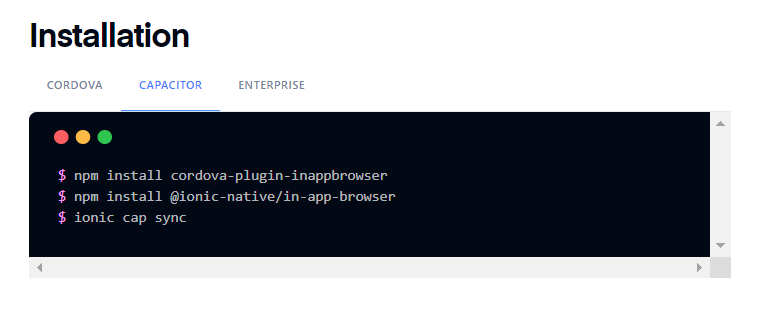
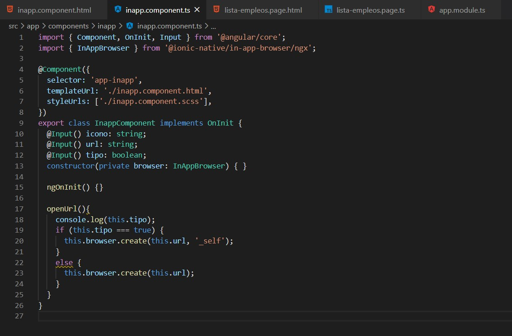
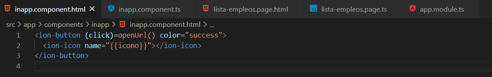
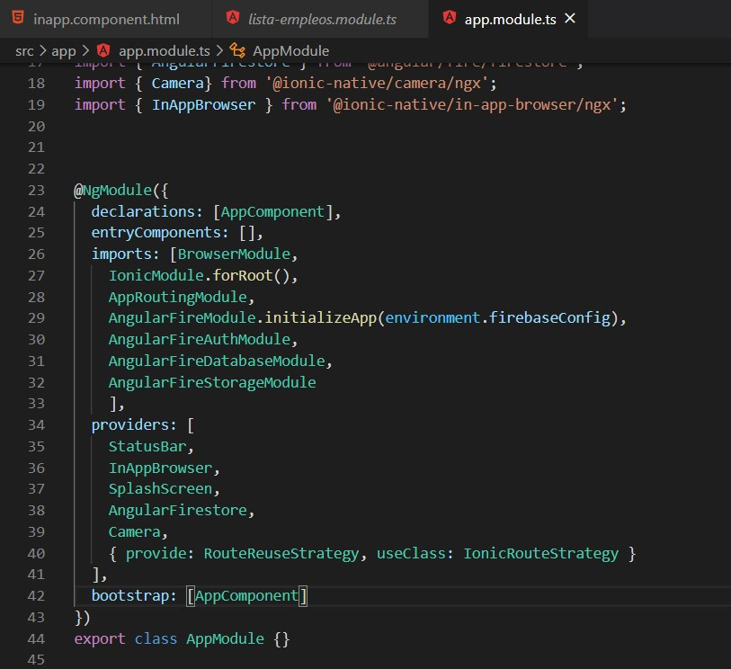
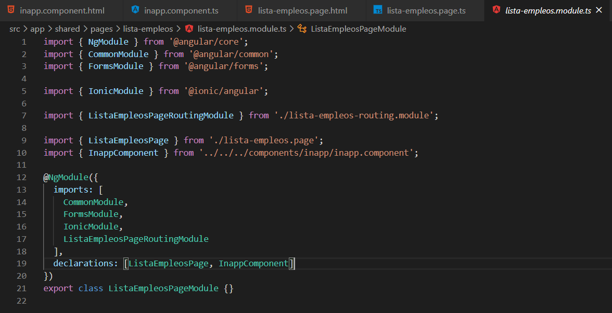
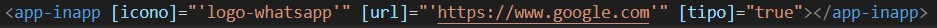

# curriculum
# Nombre: Esteban Rosero
# Modulo de ionic Native InAppBrowser

Para crear el modulo de InAppBrowser es necesario instalar desde la pagina oficial de ionic, en esta url:
https://ionicframework.com/docs/native/in-app-browser  
en el apartado hay 3 lineas de codigo que debemos correr para instalarlo y son estas: 
 
luego de haber hecho la instalacion procedemos a crear el modulo con los comandos: 
ionic generate component "el nombre del componente" 
Al crear el componente tenemos los archivos .html y el .ts que son los mas importantes en el .ts va lo siguiente: 
aqui especificamos que va a venir como parametro la url, el icono del boton y tambien el tipo, en tipo especificamos si queremos 
ingresar al url desde el navegador externo o dentro de la misma aplicacion este parametro es un boolean en el caso que tipo sea 
igual a false se abriria un navegador externo, aqui podemos ver que la funcion es abrir url y dentro de la funcion url tenemos el browser.create que crea la pagina
 
luego debemos crear el html y debe quedar de la siguiente manera: 
 
procedemos despues a importar el modulo dentro de la pagina donde vamos a crear para eso primero debemos ir a app.module y en providers colocar InAppBrowser asegurarse de que esta importado como en la siguiente imagen: 
 
tambien debemos importar en el module de la pagina a la que vamos a implementar el componente como en esta imagen: 
 
y listo solo nos queda implementar en el html de la pagina la siguiente linea de codigo: 
 
